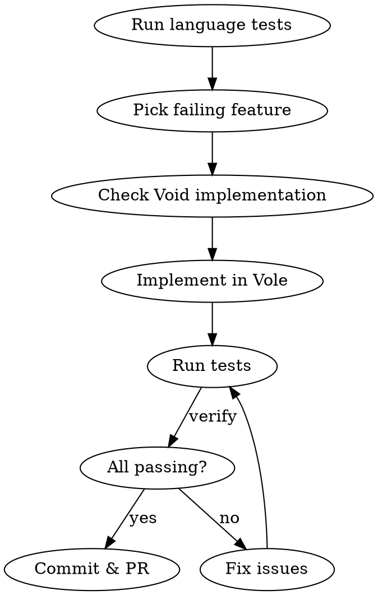

# Implementing Vole Features

## Overview

Vole is a Rust port of Void (written in Zig). Work happens in git worktrees. The goal is to get all language tests passing by implementing missing features.

## Setup Checklist

When starting in a worktree:

1. **Read project instructions** from main repo:
   - `../../CLAUDE.local.md` - private instructions (points to Void sources)
   - `../../CLAUDE.md` or `./CLAUDE.md` - project overview

2. **Run language tests** to see current state:
   ```bash
   cargo run --bin vole -- test test/unit/
   ```

3. **Identify failing tests** - failures show unimplemented features

## Void Reference

Original Void sources are at `~/code/personal/void`:
- Language docs: `~/code/personal/void/docs/`
- Tests: `~/code/personal/void/test/`
- Implementation: `~/code/personal/void/src/`

Consult Void when implementing features to match semantics.

## Workflow



## Key Commands

| Command | Purpose |
|---------|---------|
| `just ci` | Run all checks (format, clippy, test, snap) |
| `just unit` | Run unit tests only |
| `cargo run --bin vole -- test path/` | Run specific test file/dir |
| `cargo run --bin vole -- check file.vole` | Type-check without running |

## Test Organization

- `test/unit/` - Unit tests with `tests { }` blocks (preferred)
- `test/snapshot/` - Error message snapshots

Prefer unit tests for features that compile successfully.
